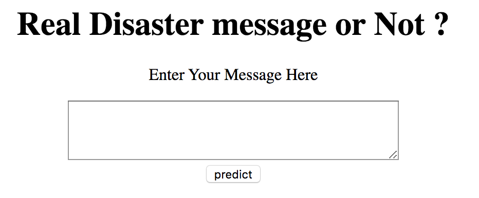
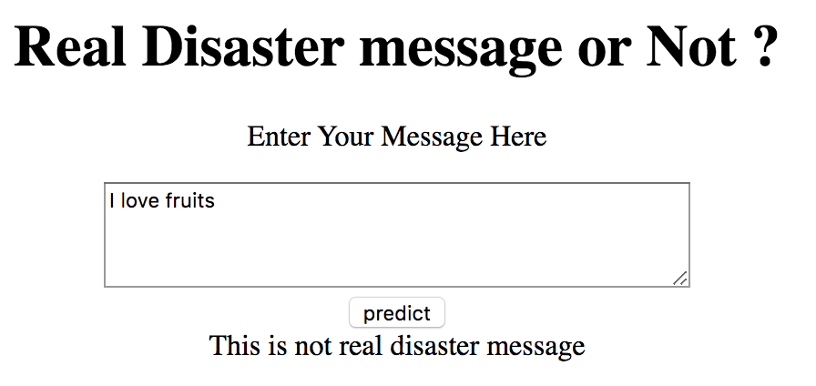

# Tensorflow-nlp-java-spring

Participated in Kaggle competition - https://www.kaggle.com/c/nlp-getting-started
Traind natural language processing model by preprocessing data and using LSTM deep learning model,
Served trained model to Java Spring for Java Spring for easy GUI.
By serving the trained model to web application, make this model available to other users.

## Simple UI

